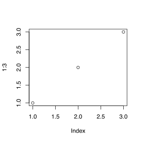

Заголовок презентации
========================================================
author: Альтшулер Евгений
date: 2019-01-24
width: 1900
height: 900
transition: none
font-family: 'CMU Sans Serif'
css: style.css


Подзаголовок презентации
---

План урока
===

## На сегодня - практика

* ДЗ и вопросы
* Дисперсионный анализ, множественные сравнения
  * Как описать зависимость Y от X?
  * Модель и остататки (residuals)
    * линейная регрессия
    * дисперсионный анализ (t-тест)
  * Непараметрические тесты (сравнение суммы рангов)
  * Множественные сравнения: сравниваем поправки
* Хи-квадрат
* Фишер
* Сюрприз

---

## Домашнее задание было - читать


```r
plot(1:3)
```


